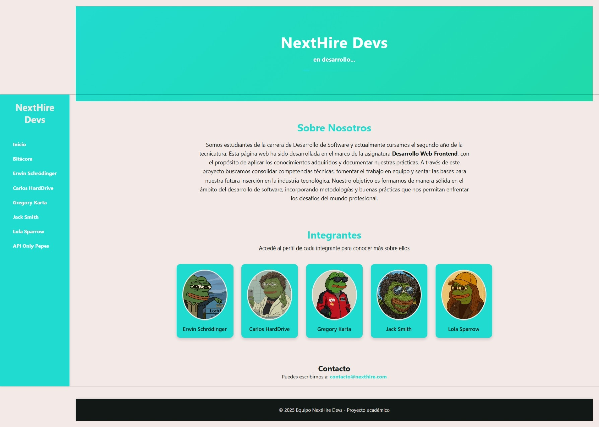
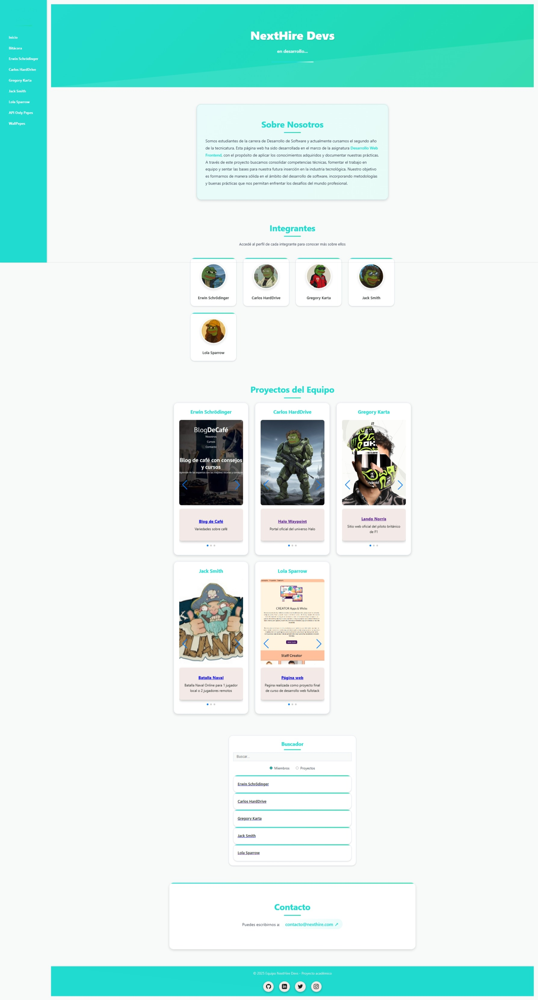
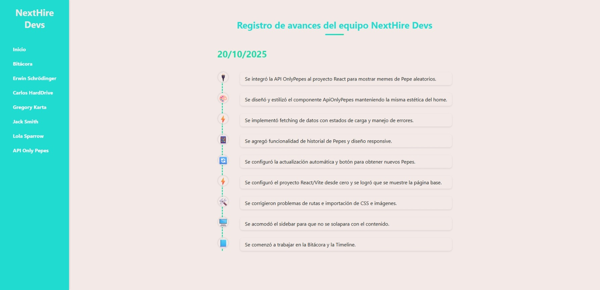
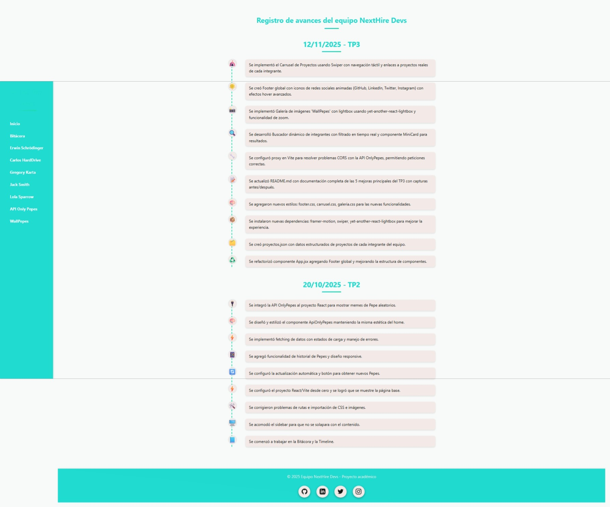
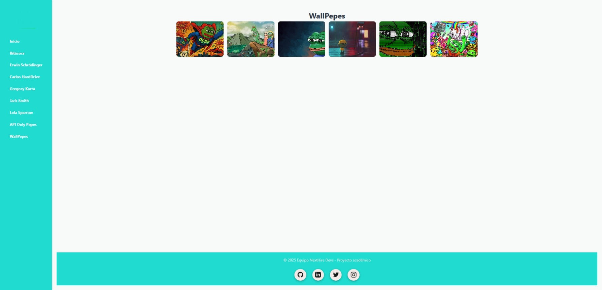

# NextHire - Devs

## IFTS29 - Front End - TP3
### Equipo:
**Grupo 1**
---
### Integrantes

- **Burgos Hernán Andrés** – *(Erwin Schrödinger)*
- **Chiovetta Nicolás** – *(Jack Smith)*
- **Donnet Leonel** – *(Gregory Karta)*
- **Leroy Delgado Adrián Agustín** – *(Carlos HardDrive)*
- **Müller Luisina** – *(Lola Sparrow)*

---

## Título del Proyecto

**NextHire - Devs**
Una plataforma para descubrir desarrolladores con estilo, creatividad y habilidades únicas (?).

---

## 📝 Descripción

**NextHire - Devs** es un proyecto desarrollado como parte del **Trabajo Práctico 3 de la materia Front End** del **IFTS N°29**.
El objetivo fue crear una aplicación web dinámica donde cada integrante del equipo cuenta con su propio perfil interactivo, utilizando React para la creación de componentes con una metodología de reutilización.

Cada perfil presenta:
- Información personal y profesional del desarrollador.
- Habilidades técnicas y blandas.
- Películas y discos favoritos.
- Enlaces de contacto y redes.

Además, el sitio se integra con una **API de OnlyPepes** para agregar un toque divertido y visual, demostrando el uso de **fetch** y manejo de datos externos en React.

---

## 🎯 Evolución del Proyecto: TP2 → TP3

### 📊 Comparativa Visual

A continuación se documentan las **mejoras principales** implementadas en esta versión del proyecto, con evidencia visual del antes y después.

---

## 🏠 Página Principal - Transformación Visual

### TP2 (Versión Original)

*Versión TP2 - Diseño inicial con elementos básicos*

### TP3 (Versión Mejorada)

*Versión TP3 - Diseño optimizado con nuevas funcionalidades*

### 🔍 Cambios Observables en la Página Principal:

#### 1. **Diseño Visual y Estética**
- **TP2:** Fondo con gradiente simple, diseño plano
- **TP3:** Wallpapers dinámicos de alta calidad (formato AVIF), mejor jerarquía visual
- **Mejora:** Mayor contraste, legibilidad optimizada, atmósfera más profesional

#### 2. **Componentes Interactivos**
- **TP2:** Cards estáticas de presentación
- **TP3:** Cards con hover effects, animaciones suaves, transiciones mejoradas
- **Mejora:** Experiencia de usuario más moderna y atractiva

#### 3. **Navegación y UX**
- **TP2:** Navegación funcional básica
- **TP3:** Menú optimizado con mejores transiciones, feedback visual
- **Mejora:** Mayor facilidad de uso, navegación más intuitiva

#### 4. **Footer Interactivo**
- **TP2:** Footer minimalista con solo texto
- **TP3:** Footer con iconos de redes sociales animados (GitHub, LinkedIn, Twitter, Instagram)
- **Mejora:** Mejor conectividad social, animaciones avanzadas al hover (scale 1.4x, rotate 15°, cubic-bezier)

---

## 📖 Bitácora - Registro de Evolución del Proyecto

### TP2 (Estado Original)

*Timeline TP2 - 1 entrada con 9 actualizaciones*

### TP3 (Estado Actualizado)

*Timeline TP3 - 2 entradas con 19 actualizaciones totales*

### 📈 Evolución Documentada:

#### **Entrada TP2 (20/10/2025) - 9 Puntos:**
1. 🎨 Diseño responsive
2. 🔄 React Router implementado
3. 📱 Componentes reutilizables
4. 🎭 Perfiles individuales
5. 🖼️ Galería de imágenes
6. 🎵 Sección multimedia
7. 💼 Información profesional
8. 🌐 Enlaces externos
9. ✨ Estilos personalizados

#### **Entrada TP3 (12/11/2025) - 10 Nuevos Puntos:**
1. ✨ **Carrusel de proyectos** - Actualización con Swiper para mostrar trabajos reales
2. 🎨 **Footer con redes sociales** - Iconos animados con efectos avanzados
3. 🖼️ **Galería con lightbox** - Modal interactivo con zoom y navegación
4. 🔍 **Buscador en tiempo real** - Filtrado instantáneo de integrantes
5. 🔌 **Integración API OnlyPepes** - Configuración de proxy para evitar CORS
6. 📝 **Mejoras en README** - Documentación completa con capturas
7. 💅 **Estilos CSS optimizados** - Nuevos archivos: footer.css, carrusel.css
8. 📦 **Nuevas dependencias** - Swiper, react-lightbox, framer-motion
9. 🗂️ **Actualización de datos** - proyectos.json con enlaces reales
10. ♻️ **Refactorización** - Componentes más modulares y reutilizables

### 💡 Beneficios de la Trazabilidad:
- Registro cronológico completo de desarrollo
- Documentación de decisiones técnicas
- Seguimiento de versiones y cambios
- Transparencia en el proceso de trabajo en equipo

---

## 🎨 Wallpapers y Optimización Visual


*Wallpapers implementados para mejorar la atmósfera visual del sitio*

### 🖼️ Mejoras en Assets Visuales:

#### **1. Formato AVIF**
- **Ventaja:** Compresión superior a JPEG/PNG (hasta 50% menos peso)
- **Calidad:** Mantenimiento de alta resolución sin pérdida perceptible
- **Performance:** Carga más rápida, mejor experiencia en móviles
- **Archivos:** `wall1.avif`, `wall2.avif` en `src/assets/img/`

#### **2. Diseño Coherente**
- Fondos profesionales que complementan la paleta de colores
- Mejor jerarquía visual de contenidos
- Consistencia estética en todas las páginas
- Fondos que no compiten con el contenido principal

#### **3. Responsive Design**
- Adaptación automática a diferentes resoluciones
- Optimización para móviles, tablets y desktop
- Uso de media queries para carga condicional

---

## 🔧 Mejoras Técnicas Detalladas

### 1. ✨ Carrusel de Proyectos Interactivo

**Librería:** Swiper v12.0.3  
**Componente:** `ProyectosCarrusel.jsx`  
**Archivo de datos:** `proyectos.json`

#### Características Implementadas:
- ✅ Navegación táctil con swipe gestures
- ✅ Flechas de navegación desktop
- ✅ Enlaces directos a proyectos reales
- ✅ Diseño responsive (móvil, tablet, desktop)
- ✅ Imágenes personalizadas por proyecto
- ✅ Transiciones suaves entre slides

#### Ejemplo de Implementación - Carlos HardDrive:
```json
{
  "id": 2,
  "integrante": "Carlos HardDrive",
  "proyectos": [
    {
      "id": 1,
      "titulo": "Halo Waypoint",
      "descripcion": "Plataforma oficial del universo Halo",
      "imagen": "/src/assets/img/halo.png",
      "enlace": "https://www.halowaypoint.com/"
    },
    {
      "id": 2,
      "titulo": "EA Sports FC 25",
      "descripcion": "Simulador de fútbol de última generación",
      "imagen": "/src/assets/img/fifa26.png",
      "enlace": "https://www.ea.com/es-es/games/ea-sports-fc"
    },
    {
      "id": 3,
      "titulo": "World of Warships",
      "descripcion": "Combate naval táctico multijugador",
      "imagen": "/src/assets/img/warship.png",
      "enlace": "https://worldofwarships.com/"
    }
  ]
}
```

---

### 2. 🎨 Footer con Redes Sociales Animadas

**Tecnología:** CSS3 Animations  
**Componente:** `Footer.jsx`  
**Estilos:** `footer.css`

#### Características de Animación:
```css
.social-icon:hover {
  transform: scale(1.4) rotate(15deg) translateY(-5px);
  transition: all 0.4s cubic-bezier(0.68, -0.55, 0.265, 1.55);
}

/* Colores específicos por plataforma */
.github-icon:hover { color: #333; }
.linkedin-icon:hover { color: #0077b5; }
.twitter-icon:hover { color: #1da1f2; }
.instagram-icon:hover { color: #e4405f; }
```

#### Funcionalidades:
- ✅ 4 iconos SVG (sin dependencias externas)
- ✅ Hover con escalado 1.4x
- ✅ Rotación de 15°
- ✅ Elevación visual (translateY -5px)
- ✅ Efecto "bounce" con cubic-bezier
- ✅ Cambio de color por plataforma
- ✅ Atributos de accesibilidad (aria-label)

---

### 3. 🖼️ Galería con Lightbox Interactivo

**Librería:** yet-another-react-lightbox v3.25.0  
**Componente:** `Galeria.jsx`

#### Características:
- ✅ Click en miniatura para modal de pantalla completa
- ✅ Navegación con flechas (UI y teclado)
- ✅ Zoom in/out en imágenes
- ✅ Cierre con ESC o botón
- ✅ Diseño responsive
- ✅ Transiciones suaves
- ✅ Soporte para múltiples formatos

#### Ventajas UX:
- Mejor visualización de detalles
- Navegación fluida entre imágenes
- Controles intuitivos
- No requiere salir de la página

---

### 4. 🔍 Buscador en Tiempo Real

**Componente:** `Buscador.jsx`  
**Tecnología:** React Hooks (useState, useEffect)

#### Funcionalidades:
- ✅ Filtrado instantáneo mientras se escribe
- ✅ Búsqueda por nombre o rol
- ✅ Sin recargas de página
- ✅ Actualización dinámica del DOM
- ✅ Feedback visual cuando no hay resultados
- ✅ Debounce para optimización

#### Implementación:
```jsx
const [searchTerm, setSearchTerm] = useState('');
const filteredIntegrantes = integrantes.filter(int => 
  int.nombre.toLowerCase().includes(searchTerm.toLowerCase()) ||
  int.rol.toLowerCase().includes(searchTerm.toLowerCase())
);
```

---

### 5. 🔌 Integración API OnlyPepes

**Configuración:** Vite Proxy Server  
**Archivo:** `vite.config.js`  
**Componente:** `ApiOnlyPepes.jsx`

#### Problema Resuelto: CORS
**Error Original:**
```
Access to fetch at 'https://api.onlypepes.com/v2/pepe' from origin 
'http://localhost:5173' has been blocked by CORS policy
```

#### Solución Implementada:
```javascript
// vite.config.js
export default defineConfig({
  server: {
    proxy: {
      '/api': {
        target: 'https://api.onlypepes.com',
        changeOrigin: true,
        rewrite: (path) => path.replace(/^\/api/, '')
      }
    }
  }
})
```

#### Uso en Componente:
```javascript
// Antes (TP2) - Error CORS
fetch('https://api.onlypepes.com/v2/pepe')

// Después (TP3) - Funciona correctamente
fetch('/api/v2/pepe')
```

#### Beneficios:
- ✅ Solución elegante sin modificar backend
- ✅ Desarrollo local sin limitaciones
- ✅ Configuración mantenible
- ✅ Mismo código para producción

---

## 📊 Tabla Comparativa TP2 vs TP3

| **Aspecto** | **TP2** | **TP3** |
|-------------|---------|---------|
| **Componentes** | Básicos, poca reutilización | Modulares, altamente reutilizables |
| **Interactividad** | Mínima (hover simple) | Carruseles, modales, búsqueda en vivo |
| **API Externa** | ❌ No implementada | ✅ OnlyPepes API integrada con proxy |
| **Animaciones** | CSS básico | Cubic-bezier, transforms, framer-motion |
| **Navegación** | Estática | React Router dinámico |
| **Galería** | Imágenes estáticas | ✅ Lightbox con zoom y navegación |
| **Footer** | Texto simple | ✅ 4 iconos animados de redes sociales |
| **Buscador** | ❌ No existe | ✅ Filtrado en tiempo real |
| **Carrusel** | ❌ No implementado | ✅ Swiper con proyectos reales |
| **Documentación** | README básico | README completo con capturas |
| **Bitácora** | 1 entrada (9 puntos) | 2 entradas (19 puntos totales) |
| **Assets** | PNG básicos | AVIF optimizados + imágenes custom |
| **Dependencias** | React básico | +Swiper, Lightbox, Framer Motion |
| **Proxy Config** | ❌ No configurado | ✅ Vite proxy para CORS |
| **Estilos CSS** | 8 archivos | 10 archivos (+ footer.css, carrusel.css) |

---

## 🚀 Tecnologías Utilizadas

### Core
- **React** 19.1.1 - Framework principal
- **Vite** 7.1.7 - Build tool y dev server
- **React Router DOM** 7.9.4 - Navegación SPA

### Librerías Agregadas en TP3
- **Swiper** 12.0.3 - Carruseles interactivos
- **Yet Another React Lightbox** 3.25.0 - Galería con modal
- **Framer Motion** 12.23.24 - Animaciones avanzadas

### Herramientas de Desarrollo
- **ESLint** - Linting de código
- **Git/GitHub** - Control de versiones
- **Vite Proxy** - Manejo de CORS

---

## 📂 Estructura del Proyecto

```
grupito-1-entregaTP3/
│
├── index.html
├── package.json
├── vite.config.js
├── eslint.config.js
├── README.md
│
├── docs/
│   ├── CAPTURAS-NECESARIAS.md
│   └── screenshots/
│       ├── pantallaprincipal-tp2.jpeg
│       ├── paginaprincipal-tp3.jpeg
│       ├── bitacora-tp2.jpeg
│       ├── bitacora-tp3.jpeg
│       └── wallpapers.jpeg
│
├── public/
│   └── assets/
│       └── img/
│
└── src/
    ├── App.jsx
    ├── App.css
    ├── main.jsx
    ├── routes.jsx
    │
    ├── assets/
    │   └── img/
    │       ├── wall1.avif
    │       ├── wall2.avif
    │       ├── halo.png
    │       ├── fifa26.png
    │       └── warship.png
    │
    ├── components/
    │   ├── ApiOnlyPepes.jsx
    │   ├── Bitacora.jsx
    │   ├── Buscador.jsx
    │   ├── Carrusel.jsx
    │   ├── Footer.jsx
    │   ├── Galeria.jsx
    │   ├── Header.jsx
    │   ├── Home.jsx
    │   ├── Integrante.jsx
    │   ├── IntegranteContent.jsx
    │   ├── IntegranteFooter.jsx
    │   ├── IntegranteHeader.jsx
    │   ├── IntegranteNav.jsx
    │   ├── MemberCard.jsx
    │   ├── MiniCard.jsx
    │   ├── ProyectosCarrusel.jsx
    │   ├── ProyectosPage.jsx
    │   ├── Sidebar.jsx
    │   └── Timeline.jsx
    │
    ├── data/
    │   ├── integrantes.json
    │   ├── integrantesData.js
    │   └── proyectos.json
    │
    └── styles/
        ├── apionlypepes.css
        ├── bitacora.css
        ├── carlosharddrive.css
        ├── carrusel.css        ← Nuevo en TP3
        ├── erwinschrodinger.css
        ├── footer.css          ← Nuevo en TP3
        ├── galeria.css
        ├── gregorykarta.css
        ├── home.css
        ├── index.css
        ├── jacksmith.css
        ├── lolasparrow.css
        └── timeline.css
```

---

## 🛠️ Instalación y Ejecución

### Prerrequisitos
- Node.js (versión 18 o superior)
- npm o yarn

### Pasos

1. **Clonar el repositorio:**
```bash
git clone https://github.com/luisimuller/grupito-1-entregaTP3.git
cd grupito-1-entregaTP3
```

2. **Instalar dependencias:**
```bash
npm install
```

3. **Ejecutar en modo desarrollo:**
```bash
npm run dev
```

4. **Acceder a la aplicación:**
```
http://localhost:5173
```

5. **Build para producción:**
```bash
npm run build
```

---

**Desarrollado con ❤️ por el Grupo 1 - IFTS N°29**  
*Front End - Trabajo Práctico 3*  
*Noviembre 2025*
